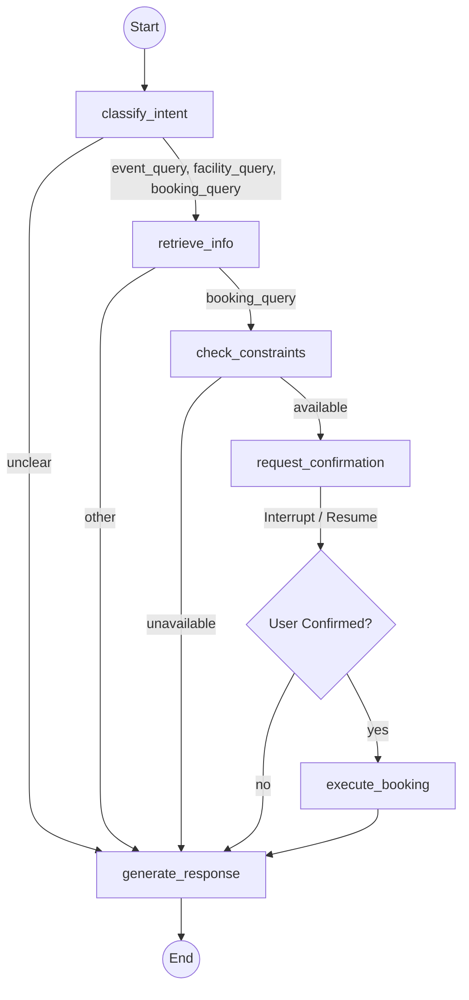

# Campus Agent

## Problem Statement

> *Note: Please insert the exact original problem statement here if needed.*

**Overview:** 
The objective of this project is to build an intelligent Campus Assistant agent capable of handling diverse user requests regarding campus events, facility information, and room bookings. The agent must intelligently route queries to the correct mock subsystem (Events JSON, Facilities JSON, Availability SQLite DB). Crucially, the agent must determine if an action requires explicit human confirmation. For any facility bookings, the agent MUST enforce constraints (operating hours, overlaps) and mandate a Human-in-the-Loop (HIL) explicit confirmation before committing the booking.

---

## Architecture Diagram

The system is built using a state machine rather than a simple sequential chain, allowing it to branch dynamically based on intent and pause for confirmation.



---

## Decision Points

Every branch in the graph serves a specific business requirement:

1. **`route_to_tool` (After Intent Classification)**
   - **Why:** The agent must decide which system to consult. If the user asks an ambiguous question, there is no need to consult any backend systems; it routes directly to `generate_response` to ask for clarification.
2. **`route_after_retrieval` (After Retrieval)**
   - **Why:** If the query is just asking for information (events/facilities), retrieving the context is enough to generate an answer. If it's a booking, basic facility info is insufficient—the agent must transition into the constraint-checking subsystem.
3. **`route_after_constraints` (After Constraint Checking)**
   - **Why:** The agent must determine if a booking is possible. If the requested slot is unavailable, we short-circuit the booking flow and head straight to `generate_response` to offer the alternative slots found in the database. If it is available, we proceed to confirmation.
4. **`route_after_confirmation` (After Human-in-the-Loop)**
   - **Why:** Execution of side effects (writing to the database) is dangerous without consent. If the user confirms, we execute. If they cancel, we safely bypass execution and acknowledge the cancellation.
   - *Design Note on Strict Confirmation:* The agent deliberately distinguishes "expressing intent to book" (e.g., "book it for me") from "confirming a specific pending booking". The confirmation node requires an unambiguous, explicit approval (e.g., "yes") rather than loose intent. This is a defensible choice to ensure strict adherence to the rule that bookings must not proceed without explicit, context-aware authorization.

### Why LangGraph over plain LangChain?
Plain LangChain (LCEL) chains are largely designed as Directed Acyclic Graphs (DAGs) for straight-through processing. While they handle RAG pipelines perfectly, they lack robust state persistence across interactive sessions. **LangGraph** was chosen specifically for its checkpointer (`MemorySaver`) and `interrupt()` capabilities. It allows the agent to pause execution mid-flow (right before booking), send a message to the user, suspend the thread in memory, and cleanly resume execution minutes or days later once the user provides their explicit `Yes/No` confirmation. 

---

## Tech Stack

| Library | Justification |
|---------|---------------|
| **LangGraph** | Provides the state machine infrastructure, cyclic routing, and most importantly, the `interrupt()` framework for Human-in-the-Loop workflows. |
| **LangChain Core** | Provides standardized schemas (`HumanMessage`, `AIMessage`) and interfaces that wrap perfectly into LangGraph states. |
| **LangChain Groq** | Connects to Groq's high-speed inference API, enabling structured output parsing via Pydantic for deterministic intent routing. |
| **Groq (LLaMA 3.3)** | LLaMA 3.3 70B is an incredibly capable open-weights model, and Groq provides near-instantaneous token generation, crucial for real-time chat APIs. |
| **FAISS & Sentence-Transformers** | Provides local, CPU-friendly dense vector search (`all-MiniLM-L6-v2`) for finding events and facilities without relying on external embedding APIs. |
| **SQLite3** | A lightweight, file-based relational database ideal for mocking a real institution's availability constraints, ensuring SQL-level uniqueness and concurrency protection on time slots. |
| **FastAPI & Uvicorn** | High-performance async Python web framework, used to expose the graph execution and handle asynchronous concurrent chat requests. |

---

## Setup & Execution

### 1. Environment Setup
1. Ensure Python 3.10+ is installed.
2. Install the requirements:
   ```bash
   pip install langchain-community langchain-huggingface faiss-cpu sentence-transformers langchain-groq fastapi uvicorn pydantic langgraph pytest pytest-asyncio
   ```
3. Copy `.env.example` to `.env` and insert your API Key:
   ```env
   GROQ_API_KEY=gsk_your_key_here
   ```
4. Seed the mock database:
   ```bash
   python -m app.data.seed
   ```

### 2. Running Locally

You can run the interactive CLI demo:
```bash
python demo.py
```

Or start the FastAPI server:
```bash
uvicorn app.api.main:app --reload
```

### 3. Example cURL Requests

**Initiating a Booking (Triggers an Interrupt):**
```bash
curl -X POST http://127.0.0.1:8000/chat \
  -H "Content-Type: application/json" \
  -d '{
    "message": "I need to book the robotics lab for tomorrow at 10 AM.",
    "thread_id": "thread-123"
  }'
```
*Response will indicate `waiting_on_confirmation: true` and ask for explicit approval.*

**Confirming the Booking (Resumes the Graph):**
```bash
curl -X POST http://127.0.0.1:8000/chat/confirm \
  -H "Content-Type: application/json" \
  -d '{
    "thread_id": "thread-123",
    "confirmed": true
  }'
```
*Response will execute the booking and return the final `booking_result` confirmation ID.*
