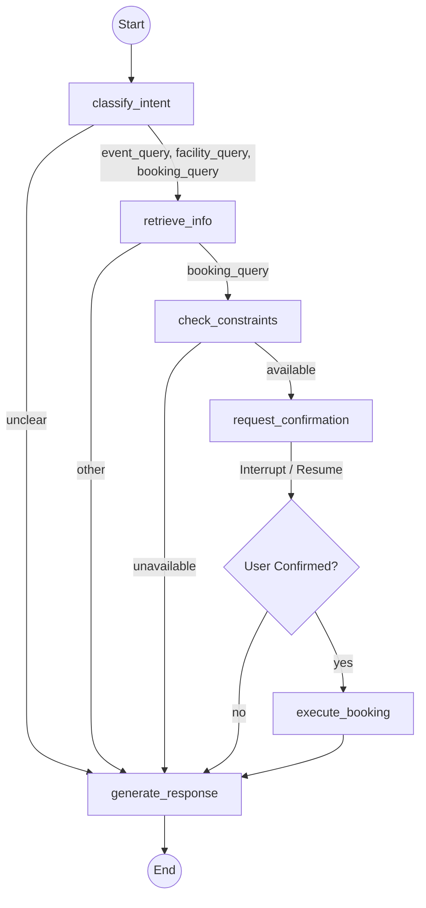

# Campus Agent

## Overview

The Campus Agent is a full-stack, AI-driven intelligent assistant designed to handle diverse user requests regarding campus events, facility information, and room bookings. It merges a modern, responsive React web portal with a powerful backend powered by FastAPI and LangGraph.

Crucially, the agent intelligently routes queries to the correct subsystem, provides real-time constraint checking (operating hours, overlaps, capacities), and mandates a **Human-in-the-Loop (HIL)** explicit confirmation before committing any side effects (like booking a room or registering for an event).

---

## Key Features

### 🖥️ Frontend (React + Tailwind CSS)
- **Responsive Portal:** A clean, mobile-friendly interface featuring dynamic `Events` and `Facilities` grids.
- **Smart Chat Widget:** A floating, collapsible chat panel that stays tucked away until needed, complete with unread notification dots.
- **Deep UI/AI Integration:** Clicking "Register" or "Check Availability" on the web portal seamlessly opens the chat and pre-fills context-aware, perfectly formatted natural language queries for the AI to process.

### 🧠 Backend (FastAPI + LangGraph)
- **Fast Static Data APIs:** Endpoints like `/events` and `/facilities` serve static JSON data directly to the frontend grids, completely bypassing the AI overhead for fast load times.
- **Intent Routing:** The AI evaluates incoming queries and routes them to specific workflows (`event_query`, `facility_query`, `booking_query`, or `unclear`).
- **Disambiguation Engine:** If a user makes an ambiguous request (e.g., "Book the lab"), the agent pauses execution, asks the user to pick from a list of relevant options, and resumes seamlessly without losing date/time context.
- **Semantic Search (RAG):** Uses local FAISS vector databases and Sentence-Transformers to retrieve relevant information based on natural language context.
- **Human-in-the-Loop Execution:** The graph pauses execution before writing to the database, sends the confirmation request to the frontend, and safely resumes upon user approval.

---

## Tech Stack

| Component | Technology | Justification |
|-----------|------------|---------------|
| **Frontend** | React, Vite, Tailwind | Provides a fast, modern, and highly responsive user interface with built-in styling utilities. |
| **Orchestration**| LangGraph | Provides the state machine infrastructure, cyclic routing, and the `interrupt()` framework for Human-in-the-Loop workflows. |
| **LLM / Parsing** | LangChain, Groq (LLaMA 3.3) | Connects to Groq's high-speed inference API, enabling structured output parsing via Pydantic for deterministic intent routing. |
| **Vector DB** | FAISS & Sentence-Transformers | Local, CPU-friendly dense vector search (`all-MiniLM-L6-v2`) without relying on external embedding APIs. |
| **Database** | SQLite3, JSON stores | Lightweight, file-based relational databases and atomic JSON writes ensuring SQL-level uniqueness and concurrency protection. |
| **API Layer** | FastAPI & Uvicorn | High-performance async Python web framework exposing the graph execution to the frontend. |

---

## Setup & Execution

### 1. Environment Setup

**Backend:**
Ensure Python 3.10+ is installed.
```bash
# From the project root
python -m venv venv
source venv/bin/activate  # Or .\venv\Scripts\activate on Windows
pip install -r requirements.txt
```

Copy `.env.example` to `.env` and insert your Groq API Key:
```env
GROQ_API_KEY=gsk_your_key_here
```

Seed the mock database for bookings:
```bash
python -m app.data.seed
```

**Frontend:**
Ensure Node.js 18+ is installed.
```bash
cd frontend
npm install
```

### 2. Running Locally

You'll need two terminal windows to run the stack.

**Terminal 1 (FastAPI Backend):**
```bash
# From the project root
uvicorn app.api.main:app --reload
```
*The API will run at http://127.0.0.1:8000*

**Terminal 2 (React Frontend):**
```bash
cd frontend
npm run dev
```
*The web app will run at http://localhost:5173*

### 3. Testing

The project includes a comprehensive suite of unit and integration tests (35+ tests) verifying the graph routing, disambiguation flows, atomic file saves, and database constraints.

```bash
# Run all tests
pytest tests/ -v --tb=short
```

---

## Architecture Flow

The system is built using a state machine allowing it to branch dynamically based on intent and pause for confirmation.


